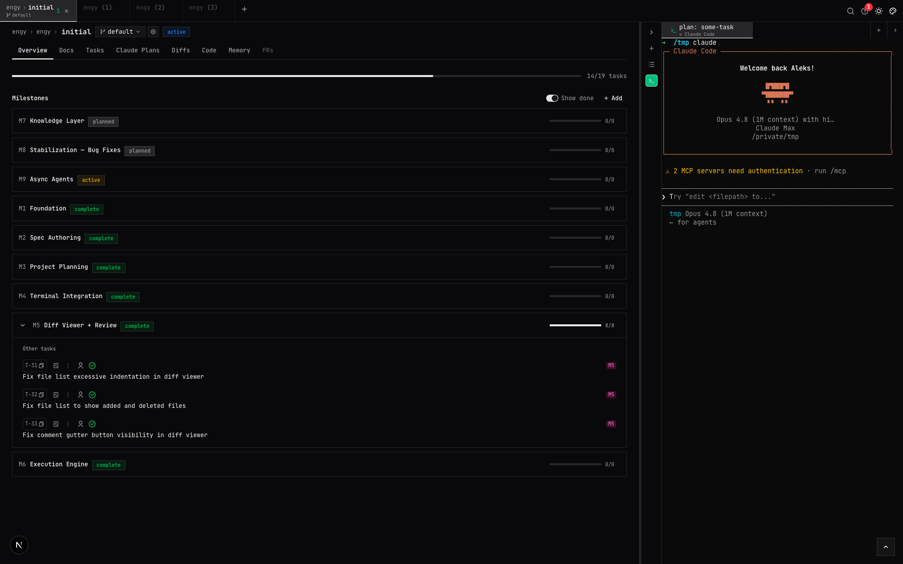
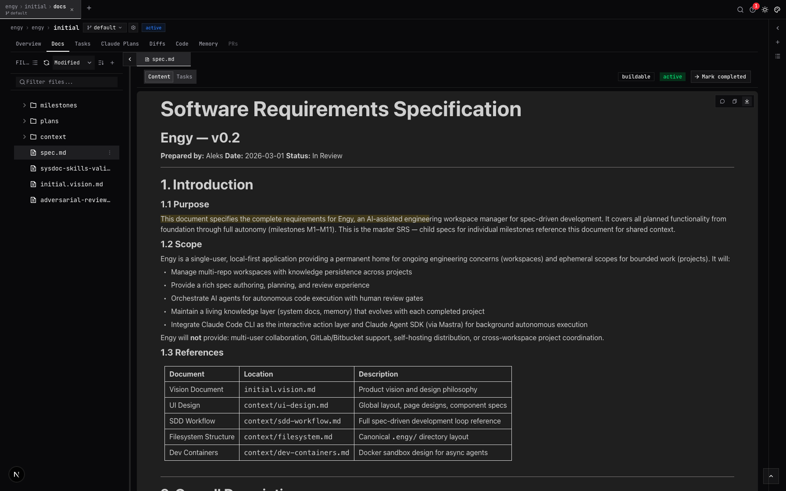
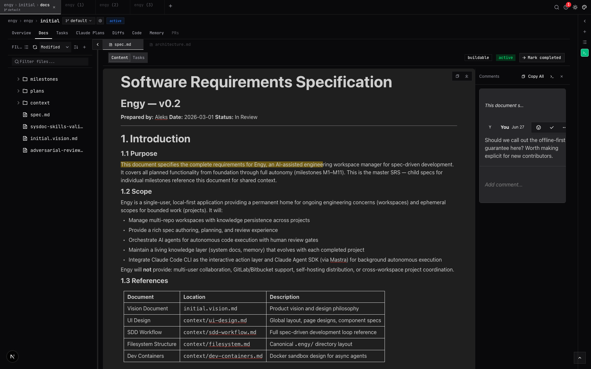
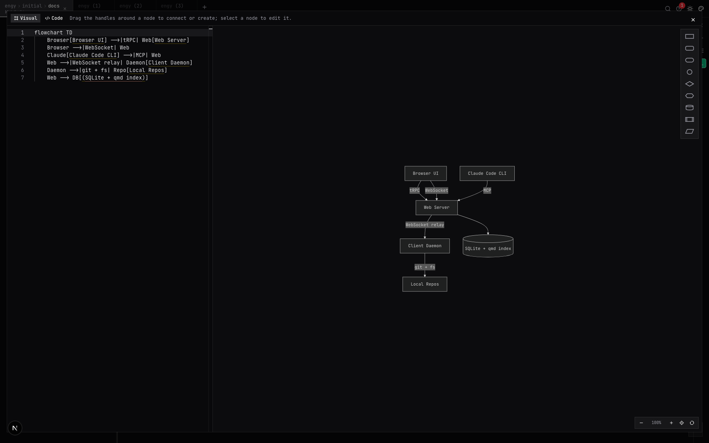
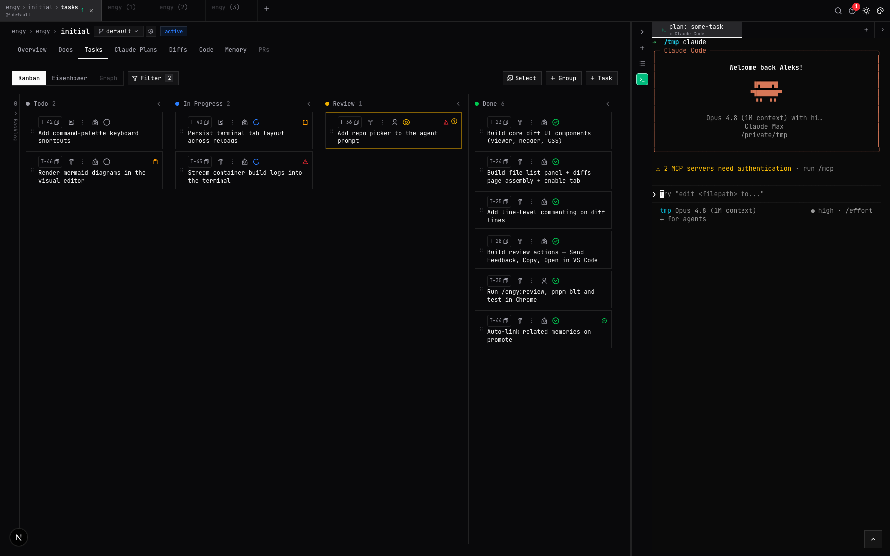
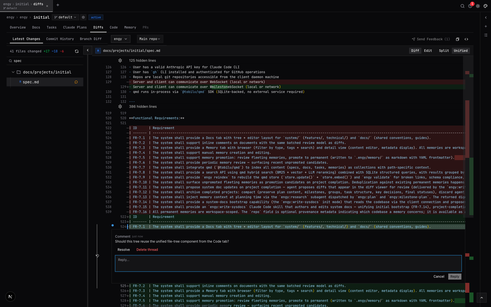
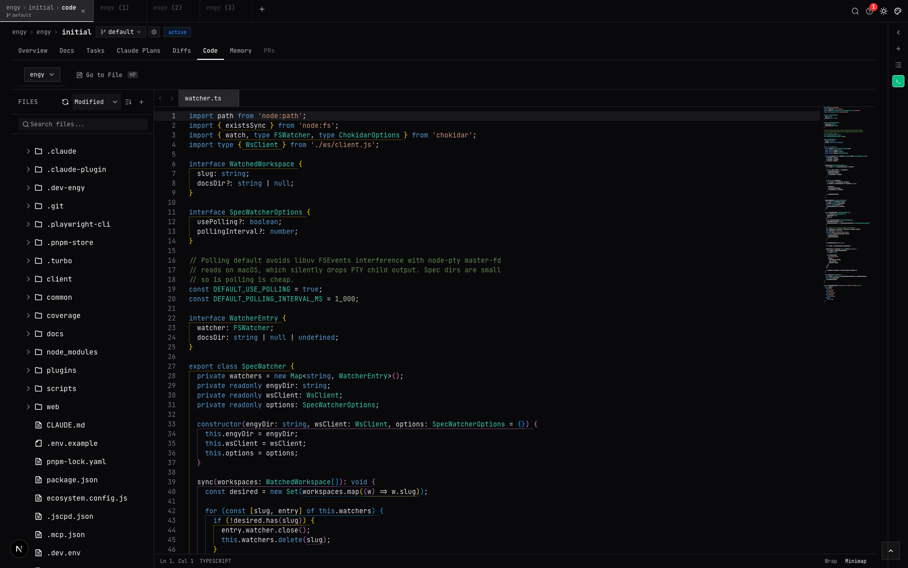
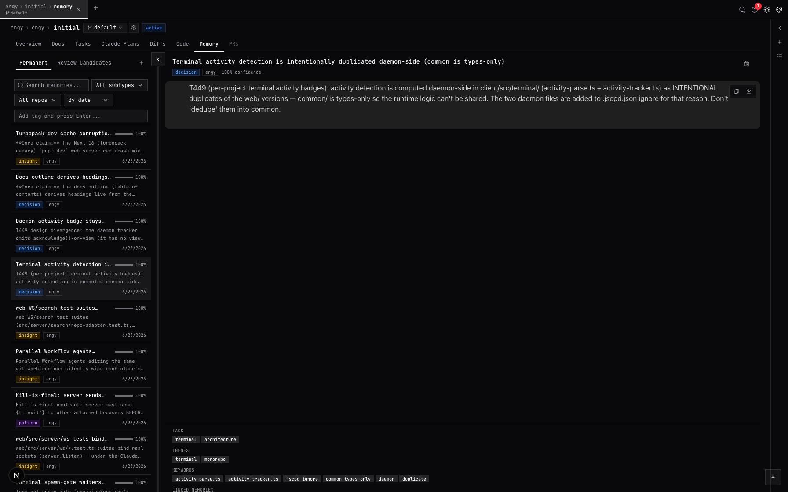
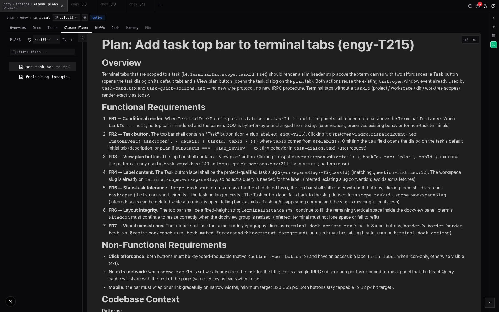
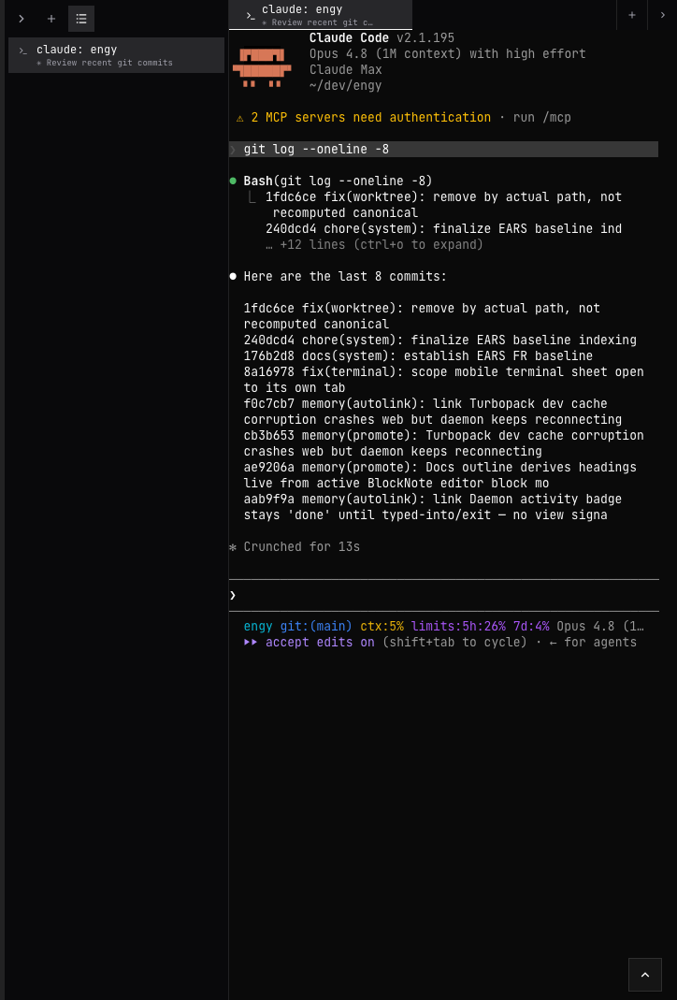

# Engy

**AI-assisted engineering workspace for spec-driven development.**

## What is Engy

Engy is a personal dev workspace for the **Specify → Plan → Execute → Complete** loop. Write specs, plan milestones, run AI agents against tasks, review diffs, send inline feedback to Claude Code, and keep the durable knowledge each project produces — all without leaving the app.

Everything is accessible to AI agents via a built-in MCP server, so the Claude Code CLI running in your terminal (or right inside Engy's own terminal) can read and write Engy data directly.

## Features

### Project Planning & Management

Plan your projects and break them into milestones and task groups. Start implementing a whole milestone, a single task group, or one task with a single click while you keep working on something else. Switch between git worktrees from the project header dropdown, and run a persistent Claude Code session in the side terminal that stays alive as you move around the app.



### Spec & Document Editor

Rich text editor for writing and reviewing specs, plans, and any markdown doc. Supports headings, tables, lists, code blocks, mermaid diagrams, @ file mentions, a live table-of-contents outline, and inline image previews. Non-markdown files render too. Open multiple documents side-by-side in dockable tabs.



Leave comment threads anchored to any passage and send them straight to a running Claude Code terminal session — your agent gets the feedback without you leaving the editor.



### Mermaid Visual Editor

Mermaid diagrams are a first-class block: they render inline (with pan, zoom, and fullscreen) and open in a **visual flowchart editor** where you add, connect, rename, reshape, and delete nodes and edges without writing diagram syntax. Source and canvas stay in sync, and the markdown round-trips losslessly as a fenced ` ```mermaid ` block.



### Task Management

Three views for managing tasks:
- **Kanban** — Backlog / Todo / In Progress / Review / Done columns
- **Eisenhower Matrix** — prioritize by urgency and importance
- **Dependency Graph** — visualize task dependencies across layers

Tasks have IDs (T-1, T-2…), types (`human` / `ai`), status badges, and a planning sub-status. AI tasks can auto-implement when created or updated.



### Diff Review & Inline Comments

Review uncommitted changes, commit history, and branch diffs with line-level commenting. Pick which repo and worktree to review from the header, leave inline comments on specific lines, and send the feedback directly to a running Claude Code session.



### Code Editor

A full-featured Monaco code editor over a unified file tree that spans your repositories. Syntax highlighting, minimap, `Cmd+P` "Go to File" quick-open, and a repo picker — browse and edit source right next to your specs and tasks.



### Knowledge & Memory

A durable knowledge layer that grows with each project. **Fleeting memories** are quick captures (`Cmd+Shift+M`, or written by AI agents) held as review candidates; **permanent memories** are curated notes — decisions, patterns, facts, conventions, insights — persisted as versioned markdown alongside the code that motivated them. Engy auto-links related memories, proposes promotion fields with the embedded LLM, and keeps each note browsable with subtype, confidence, tags, themes, and keywords.



### Global Search

Press `Cmd+K` anywhere for a unified command-palette search across system docs, project docs, memory, and tasks. Hybrid ranking (BM25 + vector) with query-shape boosting — "why" queries surface decisions, `UPPER_SNAKE_CASE` finds canonical definitions — plus structured frontmatter filters.

### Claude Plans

Review AI-generated plans and send structured feedback to a running Claude Code session. Plan review is also embedded inline in the task dialog's Plan tab.



### Built-in Terminal

A persistent, multiplexed terminal lives in a side rail so you can keep Claude Code running while you navigate the app. Sessions survive browser disconnects and daemon reconnects (with output replay), multiple browser tabs can attach to the same session, and the rail shows per-session activity badges (idle / active / waiting / done). Tab titles update dynamically from the shell's OSC title, and you can rename, reuse, or close sessions from the rail.



### Mobile Support

Use Engy from your phone. The Kanban and Eisenhower views collapse into accordion lanes, diffs use a compact viewer, and the terminal exposes on-screen buttons for keys your soft keyboard hides — Tab, Esc, Ctrl, arrows, and a Mode button for Shift+Tab.

### DevContainers & Remote Agents

Engy ships a pre-configured DevContainer setup. Enable it from Workspace settings and it scaffolds the `.devcontainer/` directory (with `devcontainer.json`, `Dockerfile`, and a firewall init script that locks outbound traffic to an allowlist). Agents can also run in remote [Coder](https://coder.com) cloud workspaces. Build progress streams as terminal output.

### MCP Server

Built-in Model Context Protocol server at `/mcp` so AI agents (Claude Code CLI) can read specs, create and update tasks, manage project state, capture memories, run unified search, and trace requirements coverage with the `trace` tool — directly.

### Workspaces

Permanent homes for ongoing concerns, tied to one or more repositories where Claude Code runs implementations. Additional repos attach as extra directories. Organize projects, tasks, docs, and memory under one roof — and run project completion to archive a finished project (surfacing any unpromoted memories for review first).

### Notifications

Get notified when a plan is ready for review or other events need your attention.

## Skills

Engy ships as a Claude Code plugin (`engy`) with skills that drive the full development loop from your terminal.

Install the marketplace:
```bash
/plugin marketplace add <cloned repo path>
```

Install the `engy` plugin, then run skills like:

| Skill | What it does |
|---|---|
| `/engy:write-spec` | Create or validate an SRS from source documents |
| `/engy:milestone-plan` | Break a spec into milestones, task groups, tasks, and dependencies |
| `/engy:plan` | Write a validated plan for a single task |
| `/engy:validate-plan` | Check a plan against its parent spec for alignment and gaps |
| `/engy:implement` | Implement a single task |
| `/engy:implement-milestone` | Orchestrate an entire milestone across task groups in parallel |
| `/engy:review` | Code review with auto-detected scope and severity-tagged findings |
| `/engy:investigate` | Explore a codebase concern and capture it as a tracked task |
| `/engy:workspace-assistant` | Quick task tracking — log bugs, create one-off work items |
| `/engy:ingest` | Capture a URL, article, or transcript into the knowledge layer |
| `/engy:knowledge-research` | Search prior decisions, patterns, and conventions |
| `/engy:review-memories` | Triage and promote fleeting memories to permanent notes |
| `/engy:session-distill` | Extract durable learnings from the current session |
| `/engy:validate` | Check knowledge integrity (broken links, stale memories) |
| `/engy:reindex` | Rebuild the search index |
| `/engy:write-sysdocs` | Author and maintain system docs |
| `/engy:feature-docs` | Author feature-area requirement docs (EARS baseline) |
| `/engy:complete-project` | Wrap up and archive a finished project |

## Getting Started

> **Work in progress — active development**
> Expect rough edges, missing features, and things that break.

**Prerequisites:** Node.js 20+, pnpm 10+

### Development

```bash
pnpm install

# Start both the web server and client daemon (auto-selects a free port)
pnpm dev
```

Read the running URL from the startup log line: `[dev] web + client running on http://localhost:<port>`.

### Production

Production is managed by PM2 (two processes: `engy-web`, `engy-client`).

```bash
pnpm install
pnpm build

# Optionally set up environment
cp .env.example .env

pnpm start        # start web + client under PM2
pnpm cycle-web    # rebuild + restart only web (the daemon keeps running and reconnects)
pnpm stop         # stop + remove both processes
```

Open [http://localhost:3000](http://localhost:3000) (or whichever port you configured).

The `web/` server runs on the configured port. The `client/` daemon connects to it over WebSocket — it handles local filesystem access and git operations on your machine.

**Environment variables** (see `.env.example`):

| Variable | Default | Description |
|---|---|---|
| `PORT` | `3000` | Web server port |
| `ENGY_DIR` | `~/.engy/` | Data directory (SQLite DB + workspace dirs). Dev default: `.dev-engy/` |
| `ENGY_SERVER_URL` | `http://localhost:3000` | Server URL for the client daemon |

## Usage

### Create a Workspace

From the home page, click **+ New Workspace** and give it a name and slug. This is where Engy stores documents as git-trackable markdown. Workspaces also have their own **Tasks**, **Docs**, and **Memory** tabs for work that lives outside any specific project. Workspaces can have one or more repositories — the first is Claude Code's working directory, the rest are passed as additional directories.

### Create a Project

Inside a workspace, click **+ New Project**. A project is an ephemeral container for a specific initiative with its own spec, milestones, tasks, and memory.

### Write Specs

Navigate to your project's **Docs** tab. Select or create a `spec.md` file to open the rich text editor. Collaborate with Claude and the `/engy:write-spec` skill to write your spec. Use **@ mentions** to reference files from the attached repositories. You can create a `spec.template.md` in the root of the workspace to use a custom template for new specs.

### Plan Milestones

Once the spec is ready, use the `/engy:milestone-plan` skill to break it down into milestones, task groups, and tasks. Plan and implement one milestone at a time, or plan the whole project upfront. Think of task groups as a single pull request's worth of work. On the **Overview** tab, click the implement icon on a milestone or task group to start implementing all its tasks.

### Manage Tasks

Use the project **Tasks** tab to create and organize tasks. Switch between Kanban, Eisenhower, and Graph views. All new tasks need a plan by default — click the plan icon to draft one (plans land in the `plans` directory and open in the **Docs** tab for editing and comments). Once a plan is ready, click the implement icon to run it with Claude Code.

### Connect Claude Code (MCP)

Engy exposes an MCP server at `/mcp` on the same port. To connect Claude Code CLI:

```bash
claude mcp add --transport http Engy http://localhost:3000/mcp --scope user
```

Or add it to your `.mcp.json` (adjust the port if needed):

```json
{
  "mcpServers": {
    "engy": {
      "type": "sse",
      "url": "http://localhost:3000/mcp"
    }
  }
}
```

Claude Code can then read specs, create tasks, update milestones, capture memories, search, and trace requirements.

## Architecture

pnpm monorepo with three packages:

```
web/      Next.js 16 + custom Node.js HTTP server
          ├── Frontend (App Router, React 19)
          ├── tRPC API (browser UI)
          ├── MCP server (AI agent access via Claude Code CLI)
          ├── WebSocket server (private channel to client daemon)
          └── Search index (qmd: SQLite-backed hybrid search)

client/   Node.js daemon — runs on your machine
          ├── Filesystem access (path validation, file watching)
          ├── Git operations (status, log, diffs, worktrees)
          └── Terminal & agent process relay

common/   Shared TypeScript types only (WebSocket protocol)
```

The server never touches user repos directly — every filesystem and git operation is relayed to the local client daemon over WebSocket, so the server can run remotely while your repositories stay local.
