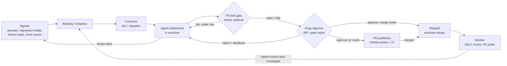
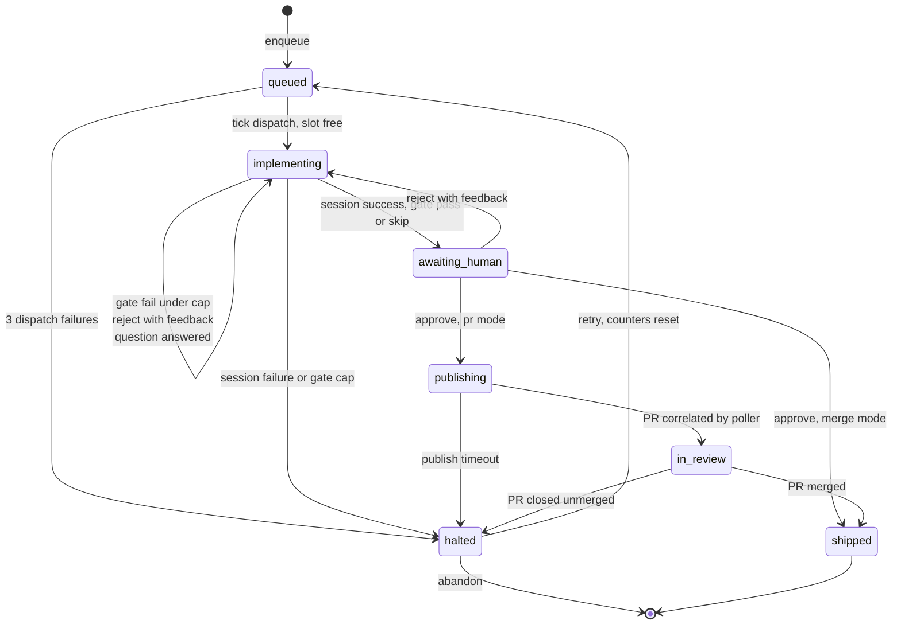
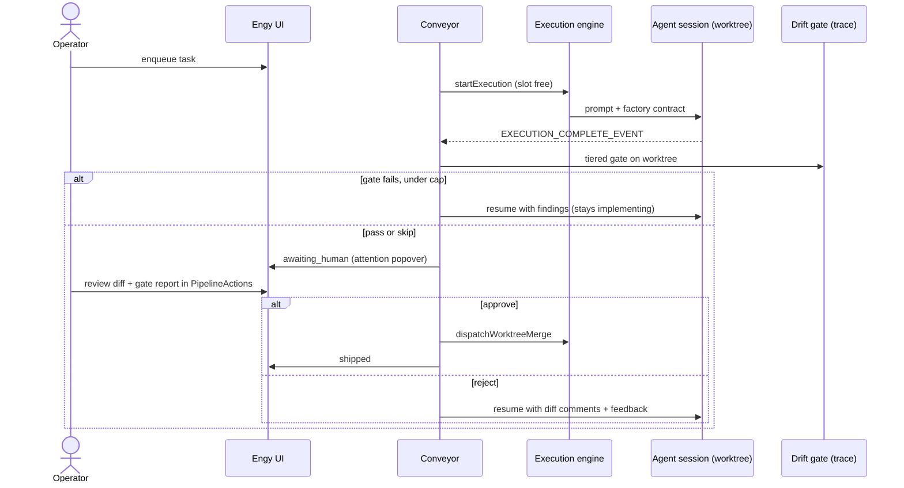
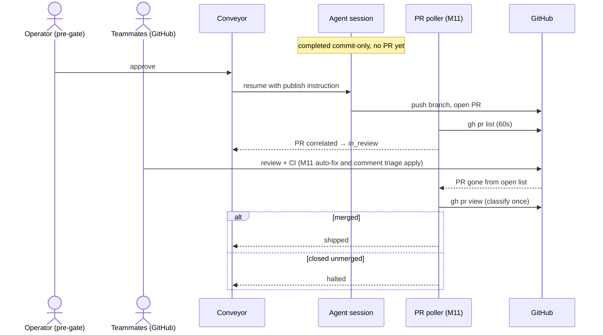
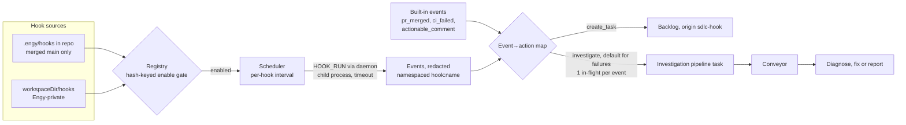

# Plan: M12 Software Factory

## What Is a Software Factory

A software factory is an internal machine that runs the software development lifecycle itself: signals (bug reports, feature requests, CI results, deploy status) flow through triage → spec → implement → review → verify → ship → monitor, with agents executing the stages and humans operating the gates. The engineer's job shifts from writing each change to building and tuning the machine that produces changes — "the job of the engineer is no longer to write code… it's to build the thing that builds the product" ([Warp](https://www.warp.dev/blog/we-are-now-factory-engineers-not-product-engineers)). Success is measured not by features shipped by hand but by the **percentage of changes shipped automatically, and at what cost** (inference + human time). The complementary principle ([Factory.ai](https://factory.ai/news/software-factory)) is that every stage feeds shared context — verification informs review, incidents correlate to PRs, human interventions become training data for the machine — so the factory improves itself over time.

**Engy IS the factory.** This is not a feature bolted onto Engy — it is the thesis of the product. Engy already ships every stage as a user-invoked capability: spec authoring, milestone planning, task plans, agent implementation in worktrees, review, PR/CI monitoring, an FR/trace blueprint, a question protocol for stuck agents, and a knowledge layer that accumulates learnings. What is missing is the conveyor: the machine that moves work through those stages without a human driving each transition, holds it at explicit human gates, measures itself, and lets agents route friction back into the system. M12 builds that conveyor. The FR baseline acts as the factory's blueprint where it exists — the drift gate refuses to advance work whose contracted behaviour is untested — but the factory runs fine without FRs (they make it stricter, never heavier).

## Overview

M12 delivers an opt-in, server-driven task pipeline: a task is explicitly enqueued, the conveyor dispatches implementation through the existing execution engine when a slot frees (or delivers it to a connected terminal session the user watches), session completion runs an optional tiered FR drift gate, work holds at an Engy approval gate with the diff and gate report in one surface, and ships through either path — direct worktree merge (`autoAgentCompletion: 'merge'`) or the PR path (`'pr'`): approve publishes the PR, external humans review on GitHub with the existing M11 machinery (CI auto-fix, comment triage) applying unchanged, and a detected merge marks the task shipped. Factory-dispatched agents get a factory contract in their system prompt — ask questions when blocked (surfaced as a visible stall), capture learnings as memories, file out-of-scope friction as attributed backlog tasks (optionally auto-enqueued). Per-project SDLC hooks — TypeScript files agents themselves can author, living in the repo or Engy-privately in the workspace dir — let each project teach the factory its own lifecycle events (deploy started/failed, custom checks); failure events feed straight back into the conveyor and get auto-investigated by a dispatched agent. Every transition lands in a `pipelineEvents` ledger, aggregated into a Factory dashboard: auto-advance rate, interventions, cycle time per stage, tokens per shipped task. A single header "needs me" surface collects everything awaiting the operator.

Boundary: no external signal ingestion beyond hook-emitted events (no GitHub-issue triage), no autonomous FR authoring or FR lifecycle states, no parallel scheduling beyond the existing `maxConcurrency` gate, no agent-driven orchestration (the conveyor may *deliver* work to terminal sessions, but orchestration control is always server-side), no model routing, no automated self-improvement loop (the intervention/friction data is captured; acting on it is a future milestone), no server/daemon GitHub write operations (all GitHub writes stay agent-mediated), no dollar-cost accounting (token counts only).

## Key Decisions

1. **Server-driven conveyor; headless execution engine as the default dispatch, terminal sessions as a supported alternative.** Two execution models exist: the execution engine (`startExecution` / `triggerAutoStart` / `maybeDispatchCiFix`) and the terminal layer (`terminal_spawn`/`terminal_dispatch`). The conveyor's **state machine** is server-driven and DB-backed (pipeline state must survive restarts, like `agentSessions`; `maybeDispatchCiFix` proved the unattended-loop shape — typed gates, attempt caps, compensating writes). Its **dispatch** defaults to the headless execution engine, but normal interactive terminal sessions stay first-class *(user direction)*: a queued task can instead be delivered to a connected worker terminal via the existing dispatch machinery, so the user watches and interjects while the conveyor still tracks stages. Terminal-mode caveats are handled explicitly (in-memory worker state → reconciliation re-queues on restart or vanished worker; stage advance keys off the dispatch reply contract). *KISS fallback recorded:* if the plan pass finds the reply-contract bridge too heavy for v1, the fallback is manual terminal work adopted into the pipeline at `awaiting_human` via one extra legal transition — the capability survives either way.
2. **Two gates in PR mode: Engy pre-gate, then GitHub.** *(user decision)* Pipeline tasks in `'pr'` workspaces complete with a committed branch but no PR; the Engy approve is the pre-gate ("this is worth other humans' review time"), publishing the PR; GitHub review by teammates is the second gate; a detected merge = shipped. External reviewers stay where they already work, and the operator gets a kill-switch before anything becomes publicly visible.
3. **FRs are optional — the gate is tiered and auto-detected.** *(user decision)* Task has target FRs → full gate (ledger clean + targets covered). Workspace has feature docs but the task has no targets → ledger-health check only. No feature docs at all → gate skipped. No configuration, nothing required; FRs sharpen the factory where they exist without being a toll gate anywhere.
4. **Friction tasks file to backlog by default; auto-enqueue is an opt-in setting.** *(user decision)* Agents are instructed to file out-of-scope friction via `createTask` (passing their task id for attribution) and keep going. Default: a human triages before anything enters the pipeline. With `frictionAutoEnqueue` on, friction tasks auto-enqueue with a depth-1 guard read from the DB parent chain: a task that itself has a friction origin never auto-enqueues its own filings — the runaway task-spawns-task loop is structurally impossible.
5. **SDLC hooks are agent-authorable TypeScript files executed by the daemon.** *(user direction)* Hooks have two discovery roots: `.engy/hooks/*.hook.ts` in the repo (committed and shared — agents write them like any other code, and the merge gate applies), and `{workspaceDir}/hooks/<repo-slug>/*.hook.ts` in the Engy workspace dir — **Engy-private, for repos where nothing Engy-related may be committed** *(user constraint: Engy used solo against a shared work repo)*. Either way, "teach the factory how to detect a failed deploy" becomes an ordinary factory task. The daemon executes them (server never touches repos or user infra); they emit typed lifecycle events into the same event→action map that built-in events (PR merged/closed, CI failed, actionable comment) feed. **Failure events close the loop** *(user direction)*: their default action is `investigate` — the factory creates and enqueues an investigation pipeline task carrying the event payload, so failures are diagnosed by an agent without a human noticing first. Trust model (red-team hardened, KISS-confirmed): repo hooks are discovered **only from the merged main checkout, never from worktrees**; and any hook — repo or workspace-dir — requires an explicit one-time user enable on new or changed content, with the hook source and a diff against the last-enabled version shown in the enable prompt, before it is ever scheduled. Since the operator's standing practice is to ship on review without reading diffs (and workspace-dir hooks never pass a merge at all), this enable prompt is the one gate that actually inspects hook code; it must show the code.
6. **Simplicity guardrails (KISS round).** Seven pipeline stages — `gating` and `waiting_input` are transient/derived states, not stages. Two real task columns (`pipelineStage`, indexed/filtered; `origin`) plus one `pipelineState` JSON column holding everything else (counters, targets, gate report, worker binding, publish timestamp) — one migration, not seven, avoiding the parallel-migration merge hazard. Friction attribution is prompt-trust: agents self-report their task id to `createTask`, exactly as the shipped question protocol already does for `askQuestion` — no per-session MCP identity infrastructure for a single-user tool (the depth-1 guard still reads the DB, not the prompt). No milestone-wide toggle: enqueue is already per-task opt-in, and the two autonomous entry paths carry their own switches. One approve surface (`<PipelineActions>`), built once in TG1, filled by TG4, embedded by TG7. Stage changes ride the existing `TASK_CHANGE` event — no new event type.

## Flow Diagrams

### The factory loop (big picture)

### Pipeline stage machine (7 stages)

`gating` is transient work inside the `implementing → awaiting_human` transition; a blocked question is a derived stall state (task stays `implementing`, session paused) — neither is a stage.

### Merge-mode lifecycle (TG1 + TG4)

### PR ship path (TG3 — two gates)

### SDLC hooks and auto-investigation (TG6)

## Codebase Context

Explored 2026-07-26. Key facts the implementer must know:

- **Automated dispatch precedent** — `triggerAutoStart(caller, taskId, state)` in `web/src/server/trpc/routers/execution.ts`: gates in order on daemon `readyState === 1`, task shape, `workspace.autoStart`, then concurrency (counts `agentSessions` joined tasks→projects where `status='active'`, `updatedAt > now-24h`, `worktreePath IS NOT NULL` vs `workspace.maxConcurrency ?? 1`), then plan-file routing (`readTaskPlan` → scope `'planning'` vs `'task'`). It **explicitly excludes tasks with&#x20;**`taskGroupId`**&#x20;or&#x20;**`milestoneRef` (M9 deliberately scoped out group/milestone auto-start) — the conveyor is a separate entry point with its own gating and must not silently widen `triggerAutoStart`. `startExecution` itself has **no** concurrency/autoStart gate — only a duplicate-session guard (same task+mode, `active`/`submitted`, 24h window). Automated callers construct via `appRouter.createCaller({ state })`, fire-and-forget with logged `.catch`.
- **Session completion** — the daemon emits exactly one `EXECUTION_COMPLETE_EVENT` `{sessionId, exitCode, success, completionSummary?}` per session (`client/src/runner/index.ts`); `handleExecutionCompleteEvent` in `web/src/server/ws/server.ts` guards idempotency via `TERMINAL_SESSION_STATUSES`, then in one `db.transaction` maps outcomes (task `subStatus==='blocked'` → session `paused`; planning success → `plan_review`; else task `done` / `subStatus:'failed'`), and post-transaction runs `dispatchWorktreeMerge` when `executionMode==='task' && autoAgentCompletion==='merge'`. **This is the conveyor's advance hook** — pipeline tasks divert here: no auto-merge, no task→`done`, advance the pipeline stage instead.
- **Resume mechanics** — `sendFeedback` flips the same `agentSessions` row back to `active` with `completionSummary: null` (deliberate: `claude --resume` appends to the original JSONL) and dispatches with `[...buildResumeFlags(taskId, sessionId), '--resume', sessionId]` + `buildResumeConfig(taskId, worktreePath)` (exported from `execution.ts`, already reused by `web/src/server/pr/auto-fix.ts`). Gate-failure retries, reject-with-feedback, and the PR-publish step all reuse this path.
- **Loop template** — `maybeDispatchCiFix` in `web/src/server/pr/auto-fix.ts`: ordered typed-reason gates, attempt caps (`MAX_AUTO_FIX_ATTEMPTS = 2` per head SHA, 5 total per PR), DB mutations rolled back if dispatch throws, skip reasons surfaced via `prs.attentionReason` + `broadcastPrAttention`.
- **Timer pattern** — `web/src/server/pr/poller.ts`: self-scheduling `setTimeout` chain (never `setInterval` — no overlapping cycles), handle on `AppState` (`web/src/server/trpc/context.ts`), `timer.unref()`, short-circuit when no daemon, started/stopped from `web/server.ts`. The conveyor tick and hook scheduler copy this. Only two web-side timers exist today (MCP idle reaper, PR poller).
- **M11 PR machinery** — `prs` table upserted from `gh pr list --json` (includes `statusCheckRollup`; **only open PRs** — the poller currently **deletes rows for vanished PRs without distinguishing merged from closed**, so the PR ship path needs one extra classifying read on vanish). Correlation: `headBranch` matched against `agentSessions.branch` (`findCorrelatedSession` in `web/src/server/trpc/routers/pr.ts`). Reviewer comments import idempotently as `commentThreads` (`web/src/server/pr/review-sync.ts`); "Fix Selected" resumes the correlated session. The gh protocol pattern (common op + `client/src/gh/` runner + `dispatchDaemonOp` wrapper) has three ops to copy from. M11's boundary was **no GitHub writes** — M12 keeps it (publish/PR actions stay agent-mediated).
- **Question protocol** — `askQuestion` MCP tool (`registerQuestionTools`) takes a **self-reported** `sessionId`/`taskId` as tool parameters — the shipped precedent for prompt-trust identity that friction attribution copies. `QUESTION_CHANGE` server event `{action: created|answered, taskId?, sessionId?}`; a blocked session parks as `paused` with task `subStatus:'blocked'` in the completion handler; existing UI surfaces: `QuestionDialog`, header question badge, bouncing task-card icon. Contract documented in `docs/system/features/agent-question-protocol.md` (FR-QUESTION-010..100) — TG2 reuses the existing answer→resume flow and UI, never a parallel one.
- **MCP caller identity is terminal-only today.** The per-session `/mcp/<sessionId>` identity (`getMcpUrl`, `MCP_SESSION_PLACEHOLDER` in `web/src/lib/agent-types.ts`; `parseMcpSessionToken` in `web/src/server/mcp/index.ts`) is wired only on interactive terminal paths (`terminal-server.ts`, `terminal-dispatch.ts`). Execution-engine sessions register MCP globally (`claude mcp add … /mcp`) and arrive as **anonymous** callers — `execution.ts` passes no MCP config at dispatch. (Verified against code during adversarial review.) M12 deliberately does **not** build per-session identity for execution sessions — attribution is prompt-trust per the question-protocol precedent (Key Decision 6); build the wiring only if attribution ever needs to be tamper-proof.
- **Agent orientation** — `ENGY_ORIENTATION` constant + `buildContextBlock({ workspace, project?, repos, autoAgentCompletion?, earsBdd?, sessionId? })` in `web/src/lib/shell.ts` build the `--append-system-prompt` block; it already instructs `search` before starting and `createFleetingMemory` before finishing, and appends the completion instruction ("push your branch and create a pull request" for `'pr'` / "commit; the system will handle merging" for `'merge'`). The factory contract extends this block for pipeline dispatches; PR-mode pipeline tasks need the publish instruction *suppressed* at implement time and delivered at approve time.
- **Diff review pipeline (M5/M11)** — `commentThreads`/`threadComments` render in the diff viewer (`web/src/components/diff/`, keyed by worktree via `worktree-selector.tsx`); `ReviewActions` aggregates unresolved threads via `generateDiffFeedback` (`feedback-markdown.ts`) into `trpc.execution.sendFeedback`. The factory's reject action consumes this same pipeline; the approve surface embeds the existing diff panel rather than linking out. The shipped `plan_review` flow (artifact + approve button in one surface) is the UX precedent for the approve moment.
- **Trace system** — `traceWorkspace(ws, { fr?, file? }, codeRootsOverride, adapter)` in `web/src/server/search/trace.ts`; summary mode returns `{ totals, uncovered, orphanTags, duplicateIds, malformed }`; fr mode returns `{ found, covered, requirement, tests, sources, orphanTags }`. `resolveWorktreeRoots(sessionId)` (`web/src/server/trpc/routers/shared.ts`) swaps `ws.repos` for the session's `worktreePath` — throws for unknown sessions or missing worktrees, so the gate handles both. Scanner internals in `web/src/server/lib/requirements.ts` (`FR_TAG_PATTERN`, `buildTraceabilityMatrix`, `@rtm-ignore`). **No caching** — the matrix is rebuilt (all feature docs read + all test files globbed) on every call; fine at conveyor cadence (one gate per completion, serialized by `maxConcurrency`), never in a hot loop.
- **No cost/usage tracking exists.** `agentSessions` has no token/cost/duration/model columns. Foothold: `getSessionFile` in `execution.ts` already locates and parses the Claude Code JSONL transcript (`~/.claude/projects/**/<sessionId>.jsonl`, Coder fallback) — each assistant entry's `message.usage` block is currently discarded.
- **Events** — `ServerEvent` union + `broadcast*` wrappers in `web/src/server/ws/broadcast.ts`; the client **redeclares** payload shapes as `ServerEventMap` in `web/src/contexts/events-context.tsx`. Task/stage changes ride the existing `TASK_CHANGE`; M12 adds **no** new event type (Key Decision 6).
- **Daemon execution pattern** — injectable runners wrapping `execFileAsync` with `EXEC_MAX_BUFFER` (`client/src/git/index.ts` `GitRunner`, `client/src/gh/index.ts` `GhRunner`); WS request/response ops with `requestId` + `repoDir`, registered in all three protocol unions with a section comment; server side always through `dispatchDaemonOp`. The hook runner follows this exactly. Note `tsx` is a devDependency of `client/` only (prod runs `node dist/index.js`).
- **New project tab = three edits**: `web/src/components/layout/header/sections.ts` entry, `case` in `dispatchProject` in `web/src/components/tabs/tab-content.tsx` (M11 gotcha: forgetting the switch gives a blank tab), route page under `web/src/app/w/[workspace]/projects/[project]/`. Remixicon only; shadcn Tooltip for hovers.
- **MCP parity rule** (`web/src/server/mcp/CLAUDE.md`): every MCP tool mirrors a tRPC procedure — matching inputs, errors, side effects, broadcasts; shared helpers imported, never copied; zod schemas hoisted to module scope. All new factory mutations need both surfaces. Known pre-existing gap (do not widen): MCP `createTask`/`updateTask` do not call `triggerAutoStart`.
- **Schema rules** (`web/src/server/db/CLAUDE.md`): single `schema.ts` with section comments, integer PKs, ISO-string timestamps, `text({ enum })`, JSON via `text({ mode: 'json' }).$type<T>()`, explicit `onDelete`, `pnpm drizzle-kit generate`, never hand-edit migrations.
- **Tasks today**: `status` `['backlog','todo','in_progress','review','done']`, `subStatus` `['planning','implementing','blocked','failed','plan_review']`, Eisenhower `importance`+`urgency`, `needsPlan`, `sessionId`, `feedback`. The conveyor adds a parallel `pipelineStage` — existing status semantics and everything reading them stay untouched.
- **UI has no chart library** — only `mermaid` (document editor). Dashboard uses stat tiles + `web/src/components/ui/progress.tsx` + hand-rolled inline SVG (precedent: `dependency-graph.tsx`). No aggregate project-wide status view exists yet.
- **Testing gotchas**: web WS suites bind real sockets — run unsandboxed; they flake under turbo load (verify with standalone `pnpm vitest run`). Web component tests are pure `.test.ts` helpers only (no testing-library).

Prior-knowledge digest (workspace memory + docs): No factory/pipeline/autonomy layer exists yet — M12 is greenfield at that level. Substrate: task lifecycle (`docs/system/features/task-management.md`; milestone status is itself a strict one-step state machine worth copying), execution engine (`docs/system/features/execution-engine.md`, `engy-T95.plan.md` for the original auto-start design, `m9-async-agents.plan.md` — M9 explicitly deferred group/milestone auto-start), terminal relay (`terminal-relay.md`, `mcp-server-session.md`, `engy-T232.investigation.md` — read its "Implementation outcome" for design divergences), and the planning→plan\_review→approve→implement human-gate flow, a shipped pattern the factory's approve gate mirrors. `engy-T21.plan.md` documents today's agent-tool-based "conveyor" (`implement-milestone`: orchestrator dispatches subagents, circuit-breaker after 3 failed fix cycles) — M12's server-driven conveyor is a parallel mechanism, not a replacement. Known gotcha: parallel agents sharing one worktree have silently wiped each other's uncommitted work (T231/T271/T272 incident) — the conveyor serializes via `maxConcurrency` and per-task worktrees and must never dispatch two pipeline tasks into one worktree. A `trace` run during research showed **30 uncovered FRs** workspace-wide (0 orphans/duplicates/malformed) — a ready-made seed set for the regression lane. DB-first with compensating delete on failure is the established durability pattern (routers CLAUDE.md, memory layer). No prior art for cost/intervention metrics.

## Task Group Sequencing

Strictly stacked PRs (each TG extends conveyor/completion files the previous one created):

- **TG1: Conveyor Core** — no dependencies. Stage model, enqueue, tick/dispatch, completion advance, merge-mode ship, the approve surface, the attention popover, terminal dispatch mode.
- **TG2: Factory Agent Contract** — depends on TG1 (orientation delivered at conveyor dispatch; question stall visibility; friction attribution + optional auto-enqueue).
- **TG3: PR Ship Path** — depends on TG1 (extends the approve action; adds `publishing`/`in_review` transitions; consumes M11 poller correlation).
- **TG4: FR Drift Gate** — depends on TG1 (runs at the completion hook before `awaiting_human`; fills the approve surface's report slot; uses the reject/resume path).
- **TG5: Regression Lane** — depends on TG1 (creates+enqueues pipeline tasks) and TG4 (lane tasks carry target FRs).
- **TG6: SDLC Hooks** — depends on TG3 (built-in PR lifecycle events come from the poller paths TG3 touches).
- **TG7: Metrics & Dashboard** — depends on TG1 (reads `pipelineEvents`); sequenced last (touches conveyor/completion files across all TGs).

## TG1: Conveyor Core

The vertical slice that makes the factory real: a task explicitly enters the pipeline, the conveyor dispatches implementation when a slot frees, completion advances to a human gate instead of auto-merging, and approval ships through the existing worktree merge — with the decision surface (diff + report + actions), the "needs me" attention popover, and terminal-session dispatch all part of the core slice. The stage enum (7 stages: `queued`, `implementing`, `awaiting_human`, `publishing`, `in_review`, `shipped`, `halted`) and the pure transition model are defined here once — later TGs activate transitions, they never migrate the enum. `gating` and `waiting_input` are deliberately NOT stages (transient work and derived state respectively — Key Decision 6).

### Requirements

1. The system shall support enqueuing an AI task into the pipeline (stage `queued`) via tRPC and MCP with parity; tasks with a `taskGroupId` or `milestoneRef` are rejected with a descriptive error (standalone tasks only — the M9 exclusion carried forward deliberately). Pipeline state is two real columns (`tasks.pipelineStage` — the 7-stage enum, indexed; later `tasks.origin` in TG2) plus one `tasks.pipelineState` JSON column (counters, errors, worker binding, targets, gate report, publish timestamp — written by later TGs without further migrations), governed by a pure transition model that rejects illegal moves. *(user request; shape: KISS round)* (FR-TG1.1)
2. The system shall run a conveyor tick (self-scheduling timeout chain on `AppState`, PR-poller pattern) that, when a daemon is connected and the active-session count is below `maxConcurrency`, dispatches the oldest `queued` pipeline task per its dispatch mode (headless via the execution engine with `triggerAutoStart`'s plan-file routing — the default; terminal mode per FR-TG1.8) and advances it to `implementing`; a dispatch failure reverts to `queued` with the error recorded in `pipelineState`, and 3 consecutive dispatch failures move it to `halted`. The tick also reconciles stranded state from the DB every cycle: an `implementing` task whose session is terminal — **excluding sessions paused on a blocked question** — is advanced as if its completion event just arrived (which re-runs the TG4 gate when applicable); a `publishing` task past its persisted publish deadline is halted; a terminal-mode task whose worker vanished is re-queued. Recovery derives from persisted state only — a restart never strands a task. *(user request; reconciliation: gaps review; blocked-exclusion caveat: KISS round)* (FR-TG1.2)
3. When a pipeline task's session completes successfully, the system shall advance the task to `awaiting_human` (TG4 later inserts its gate check into this same transition) and shall NOT auto-merge even when `autoAgentCompletion='merge'`; on session failure the task moves to `halted`. Non-pipeline completion behaviour is byte-for-byte unchanged. *(user request)* (FR-TG1.3)
4. The system shall provide approve and reject actions (tRPC + MCP) on an `awaiting_human` task: in merge-mode, approve merges the session worktree via the existing merge dispatch and advances to `shipped` (task `status:'done'`), merge failure → `halted` with the error recorded; reject aggregates unresolved diff comment threads via the existing `generateDiffFeedback` pipeline plus optional free text, resumes the session (existing `sendFeedback` mechanics), returns the task to `implementing`, resets the attempt counters, and is recorded as an intervention. All human actions are compare-and-swap on the current stage (`UPDATE … WHERE pipelineStage = ?`) — concurrent duplicate or conflicting actions fail cleanly. *(user request; diff-comment reject: UX review)* (FR-TG1.4)
5. The system shall record every pipeline transition and notable event (stage enter, dispatch failure, question raised/answered, intervention, ship, halt) as rows in a `pipelineEvents` table (taskId, sessionId?, kind, stage, detail JSON, timestamp). *(inferred: TG7 metrics + debuggability from day one)* (FR-TG1.5)
6. The system shall provide one approve surface — a `<PipelineActions>` panel in the task dialog — showing the session's diff (embedding the existing diff viewer panel), completion summary, a gate-report slot (filled by TG4), and the stage-appropriate actions; approving must never require leaving the panel to understand the change (`plan_review` precedent). Task cards carry a stage badge; enqueue is reachable as a task-card quick action and from the task dialog; a stage legend appears in empty/first-run states. *(user request; one-surface + enqueue affordances: UX review)* (FR-TG1.6)
7. The system shall provide `retry` and `abandon` actions on a `halted` task (tRPC + MCP + UI) — `halted` is never a dead end. Retry accepts optional feedback delivered to the resumed/re-dispatched session; halts caused by an exhausted gate cap default to prompting for feedback (blind re-runs of a losing attempt are the exception, not the default). Abandon clears the pipeline stage; the task itself remains. *(inferred: gaps + red-team reviews; retry-with-feedback: UX review)* (FR-TG1.7)
8. The enqueue action shall accept a dispatch mode `headless` (default) or `terminal` (deliver the same prompt to a user-chosen connected worker terminal via the existing terminal-dispatch machinery, `[engy-dispatch]` reply contract); terminal-mode tasks advance out of `implementing` on the dispatch reply, count against the same concurrency accounting, carry a visible factory marker on the injected dispatch, and — because worker state is in-memory — are re-queued by reconciliation when the server restarts or the worker vanishes, with the operator prompted to repick or fall back to headless. The worker picker states its prerequisite when no workers are connected. *(user direction: normal terminal sessions stay first-class; failure UX: UX review)* (FR-TG1.8)
9. WHILE a task is in an active pipeline stage (`queued` through `in_review`), manual `startExecution` and manual `sendFeedback` for that task shall be refused with a descriptive error (conveyor-initiated calls exempt) — one driver per task at a time, with no side door around the approve gate. *(inferred: race safety, gaps + UX reviews)* (FR-TG1.9)
10. The header shall carry a "needs me" attention popover — alongside the existing question badge — listing everything awaiting the operator across the workspace: `awaiting_human` tasks, `halted` tasks with reasons, pipeline questions (age shown, linking into the existing `QuestionDialog`), and later hooks awaiting enable (TG6); entering `halted` also raises a toast. Backed by current DB state (stages are durable), so it survives closed tabs and overnight runs. *(inferred: UX review — attention must not fragment across tabs, and a stalled factory must not look like a working one)* (FR-TG1.10)

### Tasks

1. **Schema + stage model + enqueue path**
   - Files: `web/src/server/db/schema.ts` \[MODIFY] (+ generated migration: `tasks.pipelineStage`, `tasks.pipelineState` JSON, new `pipelineEvents` table), `web/src/server/factory/stages.ts` \[NEW] (pure transition model + `pipelineState` type + event-row builder), `web/src/server/factory/stages.test.ts` \[NEW], `web/src/server/trpc/routers/factory.ts` \[NEW] (`enqueue`, `list`), `web/src/server/trpc/routers/factory.test.ts` \[NEW], `web/src/server/trpc/root.ts` \[MODIFY], `web/src/server/mcp/index.ts` \[MODIFY] (`factory_enqueue` parity)
   - Implements FR-TG1.1, FR-TG1.5 (table + recording helper)
   - Enqueue validates: task exists, `type='ai'`, standalone, not already in pipeline; sets `queued`, records event, `broadcastTaskChange`. Transition model enumerates legal moves for the full 7-stage enum (later TGs activate, never migrate); illegal move throws (milestone-status precedent). Verify: `cd web && pnpm drizzle-kit generate`, `pnpm blt`.
   - Type: ai. Important + urgent (critical path).
2. **Conveyor tick + dispatch + reconciliation** (depends on task 1)
   - Files: `web/src/server/factory/conveyor.ts` \[NEW], `web/src/server/factory/conveyor.test.ts` \[NEW], `web/src/server/trpc/context.ts` \[MODIFY] (timer handle), `web/server.ts` \[MODIFY] (start/stop wiring), `web/src/server/trpc/routers/execution.ts` \[MODIFY] (extract shared concurrency-count helper — extract, don't copy)
   - Implements FR-TG1.2 (headless mode; the terminal-mode branch lands with task 6)
   - Self-scheduling `setTimeout` chain (copy `startPrPoller` structure, \~15s cadence, `unref`, skip when no daemon); dispatch via `appRouter.createCaller({ state }).execution.startExecution({ scope, id })`; compensation + failure cap in `pipelineState`; stranded-state reconciliation each cycle (blocked-question exclusion included from day one). Verify: `pnpm blt` (WS-adjacent tests unsandboxed).
   - Type: ai. Important + urgent. **Plan-warranted** (new service; extract-don't-copy surgery on execution gating).
3. **Completion advance + human actions + guards** (depends on task 2)
   - Files: `web/src/server/ws/server.ts` \[MODIFY] (pipeline branch in `handleExecutionCompleteEvent`), `web/src/server/ws/server.test.ts` \[MODIFY], `web/src/server/trpc/routers/factory.ts` \[MODIFY] (`approve`, `reject`, `retry`, `abandon`), `web/src/server/trpc/routers/factory.test.ts` \[MODIFY], `web/src/server/mcp/index.ts` \[MODIFY] (parity), `web/src/server/trpc/routers/execution.ts` \[MODIFY] (pipeline guards on manual `startExecution` and `sendFeedback`)
   - Implements FR-TG1.3, FR-TG1.4, FR-TG1.7, FR-TG1.9
   - Pipeline branch inside the completion transaction: skip auto-merge and task→`done`, advance stage, record events. `approve` (merge-mode): `dispatchWorktreeMerge` → `shipped`+`done`, failure → `halted` with compensating writes; `reject`: `generateDiffFeedback` aggregation + free text → shared resume helper, counters reset, intervention event; `retry` (optional feedback)/`abandon`. All human actions stage-CAS-guarded. Verify: `pnpm blt`.
   - Type: ai. Important + urgent. **Plan-warranted** (surgery on the completion transaction — idempotency + compensation discipline).
4. `<PipelineActions>`**&#x20;approve surface + enqueue affordances + badges** (depends on task 3)
   - Files: `web/src/components/factory/pipeline-actions.tsx` \[NEW] (diff-panel embed + completion summary + gate-report slot + stage actions), `web/src/components/projects/task-views/*` \[MODIFY] (stage badge, enqueue quick action), task dialog \[MODIFY] (panel mount + enqueue), pure helpers + `.test.ts`
   - Implements FR-TG1.6
   - Embed the existing diff viewer panel scoped to the session worktree (`plan_review` one-surface precedent); reject composes from unresolved threads + free text; stage legend in the empty state; Remixicon + shadcn Tooltip; `isPending` guards. Verify: `pnpm blt` + playwright-cli.
   - Type: ai. Important + urgent. **Plan-warranted** (diff-panel embedding touches the M5 viewer's worktree assumptions).
5. **"Needs me" attention popover + halt toast** (depends on task 4)
   - Files: header attention component \[MODIFY or NEW beside the existing question badge], `web/src/components/factory/attention-list.ts` pure helpers + `.test.ts` \[NEW], toast wiring on `TASK_CHANGE`-with-`halted`
   - Implements FR-TG1.10
   - One list: `awaiting_human`, `halted` (reason), pipeline questions (age, → `QuestionDialog`); extensible for TG6's awaiting-enable hooks; halt toast dedup per task. Verify: `pnpm blt` + playwright-cli.
   - Type: ai. Important + urgent.
6. **Terminal dispatch mode** (depends on task 5)
   - Files: `web/src/server/factory/conveyor.ts` \[MODIFY] (terminal-mode delivery via `createDispatch`/`waitForDispatchReply` exports from `web/src/server/terminal-dispatch.ts`; reply-driven stage advance; vanished-worker reconciliation), `web/src/server/trpc/routers/factory.ts` \[MODIFY] (enqueue accepts mode + worker; worker binding in `pipelineState`), enqueue UI \[MODIFY] (worker picker with empty-state prerequisite note; factory marker on injected dispatches), tests
   - Implements FR-TG1.8 (and the terminal-mode branch of FR-TG1.2)
   - Reuse the existing dispatch machinery (inbox, idle-gating, reply contract) — do not build a parallel channel; the conveyor only reads worker liveness and the settled reply. The KISS fallback (manual terminal work adopted at `awaiting_human`) is the documented plan-pass alternative if the bridge proves heavy. Verify: `pnpm blt` + playwright-cli.
   - Type: ai. Important + not urgent. **Plan-warranted** (bridges the DB-backed state machine to the in-memory dispatch layer — failure semantics need a design pass; fallback decision recorded in Key Decision 1).

**Parallelizable:** none — strictly sequential (1 → 2 → 3 → 4 → 5 → 6).

### Completion Summary

*(pending)*

## TG2: Factory Agent Contract

What drives the agents inside the factory: pipeline-dispatched sessions get a factory addendum to their system prompt — ask instead of guessing, capture learnings, file friction and keep moving — and the conveyor understands the resulting signals: a raised question is a visible stall in the attention popover (derived from the existing blocked state — not a new stage), and friction tasks carry a machine-readable origin so they can be triaged (or optionally auto-enqueued, with a structural loop guard).

### Requirements

1. The system shall append a factory contract block to the system prompt of every pipeline-dispatched session, instructing the agent to: use `askQuestion` when blocked rather than guessing or exiting; record non-obvious learnings via `createFleetingMemory` tagged with the pipeline context; file out-of-scope friction (unrelated breakage, flaky infra, stale docs) via `createTask` **passing its own task id as&#x20;**`originTaskId` and continue; and never expand the task's scope to fix friction inline. *(user request)* (FR-TG2.1)
2. When a pipeline session raises or resolves a question (existing question protocol, unchanged), the system shall record `question_raised`/`question_answered` `pipelineEvents`; the stall is presented through the existing question surfaces plus the TG1 attention popover (age shown) — derived from the existing `subStatus:'blocked'`, never a parallel stage or dialog. *(user request; derived-state shape: KISS + UX reviews)* (FR-TG2.2)
3. The system shall accept an optional `originTaskId` on `createTask` (tRPC + MCP parity); when the referenced task is a live pipeline task, the created task is stored with `origin: 'factory-friction'` and that `originTaskId` — prompt-trust attribution, exactly the shipped `askQuestion` precedent (Key Decision 6). Friction tasks are visually marked and filterable in the task board. *(user request)* (FR-TG2.3)
4. WHERE `workspace.frictionAutoEnqueue` is enabled (default off, placed beside `autoStart` in the workspace edit dialog), a friction task whose origin task has no friction origin of its own shall be auto-enqueued (depth-1 guard read from the DB parent chain, never the prompt); the setting applies only to friction tasks filed after it was enabled — flipping it never retroactively enqueues the backlog. *(user decision)* (FR-TG2.4)

### Tasks

1. **Factory contract block + dispatch wiring**
   - Files: `web/src/lib/shell.ts` \[MODIFY] (`buildFactoryContract` appended by `buildContextBlock` when factory-dispatched), `web/src/lib/shell.test.ts` \[MODIFY], `web/src/server/factory/conveyor.ts` \[MODIFY] (flag the dispatch as factory), `web/src/server/trpc/routers/execution.ts` \[MODIFY] (thread the flag)
   - Implements FR-TG2.1
   - Contract text is a constant beside `ENGY_ORIENTATION`; threading the factory flag through `startExecution` must not change non-factory prompts. Verify: `pnpm blt`.
   - Type: ai. Important + urgent.
2. **Question stall visibility** (depends on task 1)
   - Files: question create/answer server paths \[MODIFY] (record `pipelineEvents` for pipeline tasks), `web/src/components/factory/attention-list.ts` \[MODIFY] (question entries with age → `QuestionDialog`), tests
   - Implements FR-TG2.2
   - Integration points per `docs/system/features/agent-question-protocol.md`; no new stage, no new dialog. Verify: `pnpm blt` + playwright-cli.
   - Type: ai. Important + urgent.
3. **Friction origin + optional auto-enqueue** (depends on task 2)
   - Files: `web/src/server/db/schema.ts` \[MODIFY] (+ migration: `tasks.origin` closed enum `['factory-friction','sdlc-hook']` — defined once here, TG6 reuses it; `tasks.originTaskId`; `workspaces.frictionAutoEnqueue`), `web/src/server/trpc/routers/task.ts` + `web/src/server/mcp/index.ts` \[MODIFY] (`originTaskId` param, parity), `web/src/server/trpc/routers/factory.ts` \[MODIFY] (auto-enqueue on attributed create, DB depth-1 guard), tests, task board \[MODIFY] (friction marker + filter), workspace settings UI \[MODIFY] (toggle beside `autoStart`)
   - Implements FR-TG2.3, FR-TG2.4
   - Prompt-trust attribution per the `askQuestion` precedent — no MCP identity plumbing (Key Decision 6); auto-enqueue reuses the TG1 enqueue path (single entry into the pipeline). Verify: `pnpm blt`.
   - Type: ai. Important + not urgent.

**Parallelizable:** none — sequential (1 → 2 → 3).

### Completion Summary

*(pending)*

## TG3: PR Ship Path

The factory for real projects with real teammates: in `'pr'` workspaces the pipeline task completes with a committed branch and **no PR**; Engy's approve is the pre-gate that publishes it; GitHub review is the second gate, with all M11 machinery (CI auto-fix, comment triage) applying unchanged; a detected merge means shipped.

### Requirements

1. WHERE the workspace has `autoAgentCompletion='pr'`, pipeline dispatches shall instruct commit-only completion (suppress the "push and create a pull request" instruction); non-pipeline dispatch prompts are unchanged. *(user decision)* (FR-TG3.1)
2. In `'pr'` workspaces, approve on an `awaiting_human` pipeline task shall resume the session with a publish instruction (push the branch, open the PR) and advance the task to `publishing`, persisting the publish start timestamp in `pipelineState`; if no correlated PR has appeared within 2 poll cycles after the publish session completes (deadline computed from persisted timestamps — restart-safe), the task moves to `halted` with a distinct reason. *(user decision)* (FR-TG3.2)
3. When the PR poller correlates an open PR to a `publishing` pipeline task (existing `headBranch` ↔ `agentSessions.branch` match), the task shall advance to `in_review` with the PR linked on the task; when a tracked PR vanishes from the open list, the poller shall classify it via a single daemon `gh` read (merged vs closed): merged → `shipped` (task `done`), closed-unmerged → `halted`. *(user request)* (FR-TG3.3)
4. M11 CI auto-fix and reviewer-comment fix dispatches targeting a pipeline task's session shall be recorded as `pipelineEvents` interventions (kind distinguishes machine-initiated vs human-initiated). *(inferred: metrics integrity — external review activity is factory activity)* (FR-TG3.4)

### Tasks

1. **Commit-only dispatch + approve→publish**
   - Files: `web/src/lib/shell.ts` \[MODIFY] (suppress completion instruction for factory `'pr'` dispatches; publish-instruction builder), `web/src/server/trpc/routers/factory.ts` \[MODIFY] (`approve` branches on `autoAgentCompletion`: merge → TG1 path, pr → publish resume, stage `publishing`, timestamp into `pipelineState`), `web/src/server/factory/stages.ts` \[MODIFY] (activate transitions), tests
   - Implements FR-TG3.1, FR-TG3.2 (halt-on-timeout lands with task 2's poller awareness)
   - Publish resume reuses the shared resume helper; record `publishing` events. Verify: `pnpm blt`.
   - Type: ai. Important + urgent. **Plan-warranted** (prompt-suppression touches `buildContextBlock` used by every dispatch — regression surface).
2. **Poller correlation + merged/closed classification** (depends on task 1)
   - Files: `common/src/ws/protocol.ts` \[MODIFY] (`GH_PR_VIEW` op — state/mergedAt for one PR), `client/src/gh/index.ts` \[MODIFY], `client/src/ws/client.ts` \[MODIFY], `web/src/server/ws/server.ts` \[MODIFY] (dispatch wrapper), `web/src/server/pr/poller.ts` \[MODIFY] (pipeline-aware vanish classification; `publishing`→`in_review` advance; publish-timeout halt), `web/src/server/pr/poller.test.ts` \[MODIFY], task detail UI \[MODIFY] (PR link on `in_review`), `web/src/server/pr/auto-fix.ts` + comment-triage dispatch path \[MODIFY] (record intervention events for pipeline tasks)
   - Implements FR-TG3.2 (timeout), FR-TG3.3, FR-TG3.4
   - Classification read only for vanished PRs correlated to pipeline tasks (bounded, not per-cycle); follow the established gh op pattern. Verify: `pnpm blt`.
   - Type: ai. Important + urgent. **Plan-warranted** (three-package protocol op + poller surgery).

**Parallelizable:** none — 2 depends on 1.

### Completion Summary

*(pending)*

## TG4: FR Drift Gate

The blueprint enforcement — tiered so FRs stay optional, and transient rather than a stage: when a pipeline session completes, the gate runs as part of the advance-to-`awaiting_human` transition (task remains `implementing` while it runs — a few seconds of trace scanning). Full check when the task has target FRs, ledger-health only when the workspace has feature docs but the task has none, skipped entirely when no FR baseline exists. Failures resume the session with the findings, bounded by an attempt cap.

The gate enforces "changed behaviour ⇒ updated FRs" mechanically, without guessing intent, through three checks: **coverage delta** (main-vs-worktree scan comparison — an FR that was covered on main and lost its tagged test in the worktree fails the gate, catching deleted/renamed tags that create no orphan); **implicit targets** (file-mode trace over the session's changed files — FRs those files already carry join the target set automatically, so touching FR-covered code activates the strict tier even when the task named no FRs); and a **docs-untouched flag** in the gate report (FR-carrying files changed but no feature doc edited — legitimate for refactors, so it informs the human gate rather than failing). The gate is static (trace scans text, it never runs tests); green tests remain the implement skill's `blt` duty and CI's in PR mode.

### Requirements

1. The system shall parse target FR ids (`FR-<AREA>-<NNN>` literals) from the task's description/plan references at enqueue time into `pipelineState`; zero targets is valid, and parsed targets are shown as editable chips on the queued task — a stray `FR-…`-shaped token in prose must not silently force the strict tier. *(user request; editability: red-team review)* (FR-TG4.1)
2. When a pipeline session completes successfully, the system shall run the drift gate against the session worktree before advancing, tiered by auto-detection: task has target FRs (declared, or implicit — FRs carried by the session's changed files via file-mode trace) → fail on `malformed`/`duplicateIds`/`orphanTags`, any target FR not `covered`, or any **coverage regression** (an FR covered in the main-checkout scan but uncovered in the worktree scan — catches deleted/renamed tags that create no orphan); feature docs exist but no targets → ledger-health + coverage-regression checks only; no feature docs → gate skipped (straight to `awaiting_human`). Sessions without a `worktreePath` fail with a distinct reason. The report records the tier applied and flags FR-carrying files changed without a feature-doc edit (informational — refactors are legitimate). *(user decision: FRs optional; delta + implicit targets: enforce "changed behaviour ⇒ updated FRs" mechanically)* (FR-TG4.2)
3. When the gate fails and fewer than 2 gate attempts have been used, the system shall resume the session with a feedback prompt enumerating the findings (task stays `implementing`); at the cap, `halted` with the report recorded — which, via FR-TG1.7, prompts for feedback on retry. *(user request; cap: loop safety,&#x20;*`maybeDispatchCiFix`*&#x20;precedent)* (FR-TG4.3)
4. When the gate passes (or is skipped), the task advances to `awaiting_human` with the gate report (tier, checks run, FRs verified, FR-review verdict when it ran) stored in `pipelineState` and rendered in the `<PipelineActions>` report slot. *(inferred: the human gate should see what the machine verified)* (FR-TG4.4)
5. WHEN the strict tier is active AND the session diff touched FR rows or test tags, the gate shall additionally dispatch an FR review agent — a one-shot headless invocation given the diff, the changed FR rows, and their tagged tests — answering two questions: do the EARS rows faithfully describe the changed behaviour, and do the tagged tests genuinely prove those rows? A negative verdict fails the gate (same bounded retry as FR-TG4.3, findings in the resume prompt); the verdict and reasoning always land in the gate report. Structural checks alone cannot catch a vacuous tagged test or a mis-describing row. *(user request: require FR review agent)* (FR-TG4.5)

### Tasks

1. **Gate module (tiered checks + report)**
   - Files: `web/src/server/factory/gate.ts` \[NEW] (`runDriftGate` + tier detection + `GateReport` type + feedback-prompt builder), `web/src/server/factory/gate.test.ts` \[NEW], `web/src/server/trpc/routers/factory.ts` \[MODIFY] (enqueue parses targets into `pipelineState`; target-chip edit mutation)
   - Implements FR-TG4.1, FR-TG4.2 (module; completion wiring in task 2)
   - `traceWorkspace` summary with `resolveWorktreeRoots(sessionId)` + per-target fr-mode calls, PLUS a main-checkout summary scan for the coverage delta and file-mode calls over the session's changed files (git diff via daemon) for implicit targets; typed findings (ledger-malformed, duplicate-id, orphan-tag, fr-uncovered, coverage-regression, no-worktree) + the docs-untouched flag; tier detection = feature-docs glob non-empty. Import `FR_TAG_PATTERN`-style matching from `requirements.ts`, don't copy. No schema change — everything rides `pipelineState`. Verify: `pnpm blt`.
   - Type: ai. Important + urgent. **Plan-warranted** (trace integration semantics — worktree scoping, daemon adapter, error taxonomy).
2. **Completion wiring + bounded retry + report UI** (depends on task 1)
   - Files: `web/src/server/ws/server.ts` \[MODIFY] (gate call post-transaction in the pipeline completion branch — it reads the worktree via daemon, never inside the DB transaction), `web/src/server/ws/server.test.ts` \[MODIFY], `web/src/components/factory/pipeline-actions.tsx` \[MODIFY] (report slot: tier, checks, target FRs with covered ticks, findings; target chips editable on `queued`), pure report-formatting helper + `.test.ts` \[NEW]
   - Implements FR-TG4.3, FR-TG4.4, gating flow of FR-TG4.2
   - Pass/skip → `awaiting_human`; fail under cap → resume via shared helper (stays `implementing`); at cap → `halted` + report; `gate_pass`/`gate_fail` events. Verify: `pnpm blt` + playwright-cli.
   - Type: ai. Important + urgent.

3. **FR review agent in the gate** (depends on task 2)
   - Files: `web/src/server/factory/fr-review.ts` \[NEW] (invocation + verdict parsing + prompt constant), `web/src/server/factory/fr-review.test.ts` \[NEW], `web/src/server/factory/gate.ts` \[MODIFY] (trigger condition + verdict into `GateReport`), tests
   - Implements FR-TG4.5
   - One-shot headless agent invocation (mechanism is the plan pass's first decision — likely a non-interactive `claude -p`-style run through the existing daemon runner with a structured-verdict contract; a cheaper model tier is acceptable for this focused judgment); triggered only on FR-touching diffs in strict tier, so cost stays proportional; timeout + failure of the reviewer itself degrades to a report warning, never a silent pass-as-fail. Verify: `pnpm blt`.
   - Type: ai. Important + not urgent. **Plan-warranted** (new one-shot agent invocation mechanism — runner reuse vs dedicated path needs a design pass).

**Parallelizable:** none — sequential (1 → 2 → 3).

### Completion Summary

*(pending)*

## TG5: Regression Lane

The first end-to-end factory lane, kept lean (KISS round): a reported behaviour violation becomes a pre-grounded pipeline task — reproduce with a failing test first, then fix until green — flowing through the conveyor and gate. FR grounding is a lightweight pick, not a matching subsystem; degrades gracefully without FRs; and the \~30 currently-uncovered FRs seed the lane on day one.

### Requirements

1. The system shall provide a regression intake (tRPC + MCP parity, reachable as a task-board toolbar action reusing the task-create dialog with a lane template) accepting a violation description and an optional FR picked from a filterable list of the workspace's FRs (id + EARS text, from the requirements matrix — a select, not a scoring engine); intake proceeds without an FR when none fits. It creates an AI task pre-filled with the lane prompt — the picked FR's EARS text, tagged tests, and colocated sources (fr-mode trace) when present; the violation description; repro-first instructions (extend/add a failing test — tagged when a target FR exists — then fix until green) — sets any picked FR as the target, and offers immediate enqueue. *(user request; simplified: KISS round)* (FR-TG5.1)
2. The system shall provide a coverage-seeding action listing the workspace's uncovered FRs (trace summary) and creating+enqueuing a coverage task per selected FR; seeded batches serialize through the conveyor's concurrency gate — one gate run per completion, so the per-completion trace rebuild stays off the hot path. *(inferred: exercises the lane on real gaps — 30 uncovered FRs found during research)* (FR-TG5.2)

### Tasks

1. **Regression intake + lane prompts + coverage seeding**
   - Files: `web/src/server/factory/regression.ts` \[NEW] (lane/coverage prompt builders + FR list from `buildTraceabilityMatrix`), `web/src/server/factory/regression.test.ts` \[NEW], `web/src/server/trpc/routers/factory.ts` \[MODIFY] (`reportRegression`, `listFrs`, `seedCoverage`), `web/src/server/trpc/routers/factory.test.ts` \[MODIFY], `web/src/server/mcp/index.ts` \[MODIFY] (parity), task-board toolbar + task-create dialog wiring \[MODIFY] (lane template + FR select), uncovered-FR multi-select surface \[NEW small component] + pure helpers/tests
   - Implements FR-TG5.1, FR-TG5.2
   - Task creation reuses the TG1 enqueue path; the FR select is a filtered dropdown over the in-memory matrix. Verify: `pnpm blt` + playwright-cli.
   - Type: ai. Important + not urgent.

**Parallelizable:** single task.

### Completion Summary

*(pending)*

## TG6: SDLC Hooks

Each project teaches the factory its own lifecycle — in code agents can write. Hooks are TypeScript files in the repo executed by the daemon on an interval; they emit typed lifecycle events (deploy started/failed, anything checkable by a script) into the same per-project event→action map that built-in events (PR merged/closed, CI failed, actionable comment) feed. Actions: `create_task` (backlog) or `investigate` (create+enqueue an investigation pipeline task carrying the event payload). Failure events default to `investigate` — a failed deploy or build feeds straight back into the factory and gets diagnosed by an agent, closing the monitor→triage loop. The enable gate is the load-bearing human checkpoint: it shows the hook's code before anything runs.

### Requirements

1. The system shall define a hook contract (types in `@engy/common`): files matching `*.hook.ts` default-exporting `{ name, intervalMs?, run(ctx) }` where `run` returns zero or more `{ event, payload, severity? }` emissions, discovered from two roots — `.engy/hooks/` in the repo (**merged main checkout only — never worktrees**) and `{workspaceDir}/hooks/<repo-slug>/` in the Engy workspace dir (Engy-private; for repos that must contain nothing Engy-related). The daemon executes hooks in child processes with a bounded timeout and output cap, reporting emissions and failures over new WS ops; workspace-dir hooks are read server-side (the workspace dir is server data) and shipped to the daemon as source in the run request — the daemon never needs workspace-dir access. Each discovered hook is registered in a content-hash-keyed registry and requires an explicit one-time user enable — the enable prompt shows the hook source and a diff against the last-enabled version, and re-enable is required on any content change — before it is ever scheduled; hooks awaiting enable appear in the TG1 attention popover. *(user request: agent-authorable TS hooks; enable gate + main-only discovery: red-team review; informed enable + attention routing: UX review)* (FR-TG6.1)
2. The system shall schedule hook execution daemon-side per hook `intervalMs` (bounded minimum; a hook still running when its next interval fires is skipped, never overlapped), isolate failures (a crashing/timing-out hook is reported and surfaced, never crashes the daemon or blocks other hooks), and surface per-hook status (last run, last result/error) in the UI. *(inferred: reliability — poller error-isolation precedent)* (FR-TG6.2)
3. The system shall maintain a per-project event→action map (DB-backed, editable via tRPC + MCP parity and a settings UI) from event name to action: `create_task` (backlog task, origin-marked `sdlc-hook`) or `investigate` (create+enqueue an investigation pipeline task carrying the event payload). Prompt/task templates ship as code constants (no editing UI in v1). Hook-emitted events are namespaced `hook:<name>`; built-in event names are reserved and cannot be emitted or spoofed by hooks. Built-in events `pr_merged`, `pr_closed`, `ci_failed`, `actionable_comment` are emitted from the existing poller/triage/review-sync paths — except `ci_failed` for a PR that M11 auto-fix is actively remediating (dispatched and under its caps), which is suppressed so one failure never runs two uncoordinated remediation paths. *(user request; namespacing + dedup: red-team review; template constants + no notify action: KISS round — the events feed and attention popover cover visibility)* (FR-TG6.3)
4. WHEN a failure-class event (`deploy_failed`, `ci_failed`, or a hook event flagged `severity: 'failure'`) has no mapping, the system shall auto-create an **enabled** `investigate` row for it in the action map (visible in settings, disable-able) and apply it — the built-in investigation template: diagnose the failure from the event payload, fix it if within scope, otherwise report findings and file friction tasks. *(user request: failures feed the factory and get auto-investigated; auto-created-row shape keeps per-row control without a milestone-wide toggle)* (FR-TG6.4)
5. Every hook emission and executed action shall be recorded (`pipelineEvents` kind `hook_event`/`hook_action` with the event name and hook in detail), with hook output and event payloads redacted (reuse M11's token-redaction patterns from the failed-logs path) before storage and before inclusion in any prompt, and payload text injection-hardened in templates (blockquoted — `generateGithubFeedback` precedent). Investigate-type actions shall be rate-limited per (event, project) to 1 in-flight pipeline task, **derived from the DB** (open pipeline tasks originating from that event; the slot clears when they reach `shipped`/`halted`/leave the pipeline — restart-safe). *(inferred: loop safety + secrets/injection hardening, red-team review)* (FR-TG6.5)

### Tasks

1. **Hook contract + daemon runner + protocol ops**
   - Files: `common/src/hooks.ts` \[NEW] (contract types), `common/src/ws/protocol.ts` \[MODIFY] (`HOOK_LIST`/`HOOK_RUN` request/response ops — section comment, three unions; `HOOK_RUN` accepts either a repo-relative path or inline source for workspace-dir hooks), `client/src/hooks/index.ts` \[NEW] (main-checkout-only repo discovery + child-process runner, injectable, timeout + output cap), `client/src/hooks/index.test.ts` \[NEW], `web/src/server/factory/workspace-hooks.ts` \[NEW] (workspace-dir discovery — server-side read of `{workspaceDir}/hooks/`), `client/src/ws/client.ts` \[MODIFY] (handlers), `client/package.json` \[MODIFY] (TS-execution runtime dependency — see below), `web/src/server/ws/server.ts` \[MODIFY] (dispatch wrappers + pending maps), `web/src/server/trpc/context.ts` \[MODIFY]
   - Implements FR-TG6.1 (contract + runner; registry lands in task 2)
   - Runner executes via the daemon's Node in a child process; the TS-execution strategy is the plan pass's first decision — `tsx` is currently a devDependency of `client/` only (prod runs `node dist/index.js`), so either promote it to a production dependency or use Node type-stripping. Follow the `GhRunner` injectable pattern. Verify: `pnpm blt` (WS tests unsandboxed).
   - Type: ai. Important + not urgent. **Plan-warranted** (cross-package protocol + child-process TS execution strategy).
2. **Registry + scheduler + event→action map + built-in events** (depends on task 1)
   - Files: `web/src/server/factory/hooks.ts` \[NEW] (scheduler — poller-pattern timer; action executor; redaction), `web/src/server/factory/hooks.test.ts` \[NEW], `web/src/server/db/schema.ts` \[MODIFY] (+ migration: `sdlcHooks` registry table — repo, path, contentHash, enabled, lastRunAt, lastError; `sdlcActions` table — projectId, event, action, enabled), `web/src/server/trpc/routers/factory.ts` \[MODIFY] (registry enable/disable + action-map CRUD), `web/src/server/mcp/index.ts` \[MODIFY] (parity), `web/src/server/pr/poller.ts` + `auto-fix.ts` + `review-sync.ts` \[MODIFY] (emit built-in events; suppress `ci_failed` while auto-fix actively remediates)
   - Implements FR-TG6.1 (registry + enable gate), FR-TG6.2 (scheduling/isolation), FR-TG6.3, FR-TG6.4, FR-TG6.5
   - Scheduler on `AppState` (third web-side timer) runs only enabled, hash-matching hooks; `hook:` namespacing enforced at ingestion; `investigate` creates+enqueues via the TG1 path with the DB-derived in-flight limit; failure-class defaults auto-create their enabled row; redaction before storage and prompt inclusion; all emissions/actions recorded. Verify: `pnpm blt`.
   - Type: ai. Important + not urgent. **Plan-warranted** (event-bus design + three emission-point integrations).
3. **Hook status + enable UI + action-map UI** (depends on task 2)
   - Files: `web/src/components/factory/sdlc-hooks.tsx` \[NEW] (hook list with status + enable/disable; enable confirm showing hook source + diff vs last-enabled hash; action-map rows), pure helpers + `.test.ts`, project settings surface wiring \[MODIFY], `web/src/components/factory/attention-list.ts` \[MODIFY] (awaiting-enable entries)
   - Implements FR-TG6.1 (informed enable + attention), FR-TG6.2 (status surfacing), FR-TG6.3 (UI)
   - New or content-changed hooks land as "awaiting enable" in both the settings list and the attention popover; the enable confirm renders the source (Monaco read-only) and the hash diff. Verify: `pnpm blt` + playwright-cli.
   - Type: ai. Important + not urgent.

**Parallelizable:** none — sequential (1 → 2 → 3).

### Completion Summary

*(pending)*

## TG7: Metrics & Dashboard

The meters on the factory wall: token usage captured per session at completion, `pipelineEvents` aggregated into the factory's core numbers — auto-advance rate, interventions by kind, cycle time per stage, tokens per shipped task — and a Factory tab showing the metrics, the live per-stage funnel (embedding `<PipelineActions>` for anything needing a decision), the friction backlog, and the recent event feed.

### Requirements

1. When a pipeline task's session completes, the system shall parse the session transcript's per-entry `usage` blocks and store aggregate token counts (input, output, cache-read) and model on the `agentSessions` row; transcript-unavailable sessions (remote/Coder without a pulled file) record null without affecting the completion flow. *(user request)* (FR-TG7.1)
2. The system shall expose a factory metrics query aggregating `pipelineEvents` + sessions for a project/workspace and time window: shipped count, auto-advance rate (shipped with zero intervention/gate-fail events ÷ shipped), interventions by kind (human reject, gate fail, CI auto-fix, comment fix), mean cycle time per stage, and token totals per shipped task. *(user request)* (FR-TG7.2)
3. The system shall provide a Factory project tab: stat tiles, a per-stage funnel of current pipeline tasks embedding `<PipelineActions>` (decisions never require leaving the tab; blocked-question entries show age), the friction backlog, and a recent-events feed; live via the existing `TASK_CHANGE` event (no new event type — Key Decision 6). *(user request)* (FR-TG7.3)

### Tasks

1. **Usage capture at completion**
   - Files: `web/src/server/execution/transcript.ts` \[NEW] (extract JSONL locate/parse from `getSessionFile` into a shared helper + usage summing), `web/src/server/execution/transcript.test.ts` \[NEW], `web/src/server/trpc/routers/execution.ts` \[MODIFY] (`getSessionFile` delegates), `web/src/server/db/schema.ts` \[MODIFY] (+ migration: `agentSessions.inputTokens`, `outputTokens`, `cacheReadTokens`, `model`), `web/src/server/ws/server.ts` \[MODIFY] (post-transaction best-effort capture, `.catch`-logged)
   - Implements FR-TG7.1
   - Extract-don't-copy the transcript reader; capture never blocks or fails completion handling. Verify: `pnpm blt`.
   - Type: ai. Important + not urgent. **Plan-warranted** (refactor of `getSessionFile` + Coder fallback paths).
2. **Metrics aggregation + full-pipeline integration test** (depends on task 1)
   - Files: `web/src/server/factory/metrics.ts` \[NEW] (pure aggregation over rows), `web/src/server/factory/metrics.test.ts` \[NEW], `web/src/server/trpc/routers/factory.ts` \[MODIFY] (`metrics`), `web/src/server/trpc/routers/factory.test.ts` \[MODIFY]
   - Implements FR-TG7.2
   - Pure functions (unit-testable without timers); router fetches + delegates. Also add the milestone's only full-traversal proof: an integration test driving one task `queued → shipped` across the complete stage machine with simulated daemon events (gap flagged in review). Verify: `pnpm blt`.
   - Type: ai. Important + not urgent.
3. **Factory tab** (depends on task 2)
   - Files: `web/src/components/layout/header/sections.ts` \[MODIFY], `web/src/components/tabs/tab-content.tsx` \[MODIFY] (`case 'factory'` — both edits required, M11 gotcha), `web/src/app/w/[workspace]/projects/[project]/factory/page.tsx` \[NEW], `web/src/components/factory/factory-page.tsx` \[NEW], `web/src/components/factory/stage-funnel.tsx` \[NEW] (embeds `<PipelineActions>`), pure helpers + `.test.ts`
   - Implements FR-TG7.3
   - Stat tiles + `progress.tsx`-based funnel (no chart lib), friction list, events feed; live via existing `TASK_CHANGE` subscription; stage legend shared with TG1's empty state. Verify: `pnpm blt` + playwright-cli.
   - Type: ai. Important + not urgent.

**Parallelizable:** none — sequential (1 → 2 → 3).

### Completion Summary

*(pending)*

## Review Provenance

Drafted 2026-07-26 from the software-factory brainstorm (Warp / Factory.ai synthesis + codebase exploration + knowledge research). Three review rounds applied 2026-07-27, all by dispatched reviewer agents:

1. **Adversarial round** (consistency / gaps / feasibility / red-team): added halted-exit actions, stranded-state reconciliation, stage CAS guards, grouped-task exclusion, hook enable gate + main-only discovery, event namespacing, `ci_failed` dedup vs auto-fix, payload redaction, DB-derived rate limits; corrected a false plan assumption (per-session MCP identity does not exist for execution sessions — code-verified).
2. **UX walkthrough** (operator journeys): one approve surface with the diff embedded (`plan_review` precedent), enqueue affordances + stage legend, header "needs me" attention popover + halt toast, reject consuming diff comments, retry-with-feedback for gate-cap halts, informed hook enablement (source + hash diff), terminal-mode failure surfacing.
3. **KISS round**: 9→7 stages (`gating`/`waiting_input` transient/derived), 11 task columns → 2 + one `pipelineState` JSON (4 migrations instead of 7), prompt-trust friction attribution via the `askQuestion` precedent (deleted the unbuilt MCP-identity substrate), dropped `factoryEnabled` and `FACTORY_CHANGE` and the `notify` action, merged the three approve-UI specs into one component, collapsed TG5 to one task, templates as code constants.

## Out of Scope

- Group/milestone-scoped conveyor orchestration — pipeline tasks are standalone tasks; grouped tasks are rejected at enqueue (M9 exclusion carried forward; `implement-milestone` remains the group-scale path)
- Per-session MCP identity for execution sessions — attribution is prompt-trust (`askQuestion` precedent); build the wiring only if attribution must become tamper-proof (e.g. multi-user)
- Global cross-mechanism retry budget — each loop has its own cap (`dispatchFailures` 3, `gateAttempts` 2, CI auto-fix 2/SHA + 5/PR, investigate 1 in-flight); a per-task aggregate budget is deferred until metrics show cap-cycling actually occurs
- `pipelineEvents` retention/pruning — deferred until the table is measurably large for a single user
- Hook-code static analysis or sandboxing beyond child-process timeout/output caps — merge gate + informed enable is v1's containment
- Hook/investigation template editing UI — templates are code constants until one actually needs changing
- Regression intake entry points beyond the task board (diff viewer, PR rows) — fast-follow once the lane proves itself
- External signal ingestion beyond hook emissions — GitHub-issue triage, log tailing, email intake (future milestone; regression intake is manual/agent-filed)
- FR lifecycle states (proposed/approved) and spec-delta approval flows — FRs remain implement-time artifacts per the EARS-BDD reference
- Automated FR authoring in the pipeline (feature-author stays human-gated)
- Parallel multi-task scheduling beyond `maxConcurrency` (per-worker worktree-isolation scheduling is future work; see the shared-worktree wipe gotcha)
- Agent-driven orchestration (`terminal_spawn` chains, agents coordinating agents) — the conveyor delivers work to terminal sessions in terminal mode (FR-TG1.8), but orchestration control stays server-side; `terminal_dispatch` as an agent-to-agent tool is untouched
- Model routing per stage; per-stage agent-type selection
- Automated self-improvement loop (intervention → memory → skill edits) — the data is captured (TG1/TG2/TG7) so a future milestone can act on it
- General review-agent stage separate from `/engy:implement`'s built-in review (the skill's internal review + the human gates cover v1) — the one exception is the scoped FR review agent inside the drift gate (FR-TG4.5), which judges FR fidelity only, never general code quality
- Server/daemon GitHub write operations (publish and all GitHub mutations stay agent-mediated)
- Dollar-cost accounting (token counts only; pricing tables change too fast to hardcode)
- Event-driven hooks (webhooks/watchers) — v1 hooks are poll-only; `intervalMs` covers deploy checks without long-lived subprocess management
